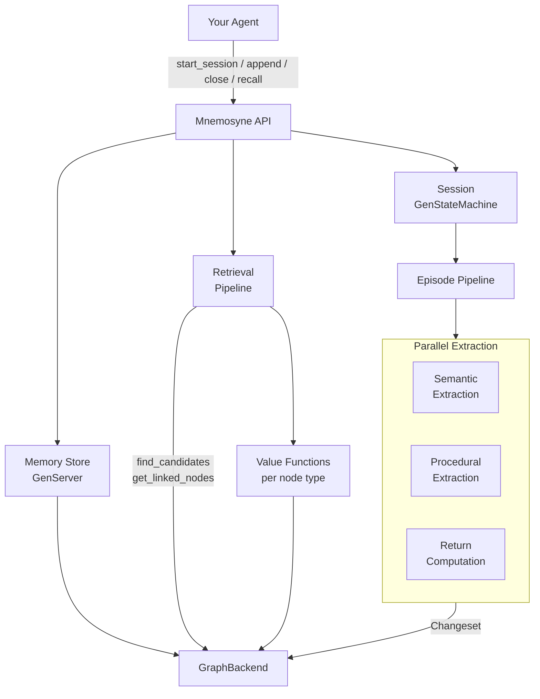
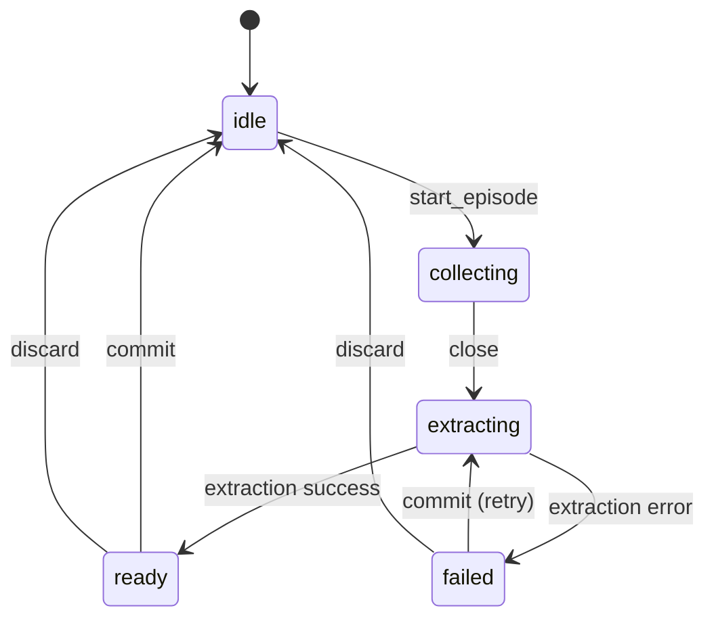

# Mnemosyne

An Elixir implementation of task-agnostic agentic memory for LLM agents, based on the [PlugMem](https://arxiv.org/abs/2603.03296) architecture.

Mnemosyne structures raw agent interactions into a knowledge-centric memory graph, transforming verbose episodic traces into compact, reusable knowledge that any LLM agent can query at decision time.

## Memory Layers

- **Episodic memory** -- detailed records of experience (observation-action pairs)
- **Semantic memory** -- propositional knowledge ("knowing that"), factual statements distilled from episodes
- **Procedural memory** -- prescriptive knowledge ("knowing how"), goal-directed action strategies

## How It Works

Mnemosyne models memory as a three-stage pipeline:

### 1. Structuring -- Episodes to Knowledge

The agent interacts with the world through **sessions**. Each session collects observation-action pairs into **episodes**, and uses LLM inference to annotate each step with subgoals, rewards, and state summaries.

When an episode closes, the **structuring pipeline** extracts knowledge in parallel:

- **Semantic extraction** -- distills factual propositions with confidence scores
- **Procedural extraction** -- abstracts reusable instructions with conditions and expected outcomes
- **Return computation** -- evaluates trajectory quality via cumulative reward signals

Trajectory boundaries are detected automatically using embedding similarity (cosine threshold), splitting episodes into coherent subsequences that share a common intent.

### 2. The Knowledge Graph

All extracted knowledge lives in a graph managed by a pluggable **GraphBackend**, with seven node types:

| Node Type | Purpose |
|-----------|---------|
| **Episodic** | Raw observation-action-reward tuples from interactions |
| **Semantic** | Factual propositions with confidence scores |
| **Procedural** | Instructions with conditions and expected outcomes |
| **Subgoal** | Decomposed objectives linking related knowledge |
| **Source** | Provenance links back to original episode steps |
| **Intent** | Goal abstractions linking related procedural nodes |
| **Tag** | Concept indices linking related semantic nodes |

Nodes are linked bidirectionally and indexed by type, tag, and subgoal for efficient traversal. Mutations are batched through **changesets** that are applied atomically.

### 3. Retrieval -- Knowledge at Decision Time

When the agent needs memory, the retrieval pipeline:

1. Computes an embedding for the query
2. Scores candidate nodes using **value functions** specialized per node type (episodic relevance, semantic relevance, procedural match, subgoal match, tag exact, source linked)
3. Returns the highest-scoring knowledge, ranked by decision relevance

## Architecture



The **Session** is a `GenStateMachine` that manages the episode lifecycle:



## Usage

```elixir
# Start a session with a goal
{:ok, session} = Mnemosyne.start_session(config, "Help user plan a trip")

# Collect observations and actions during interaction
:ok = Mnemosyne.append(session, config, "User says they want to visit Tokyo", "Asking about dates")
:ok = Mnemosyne.append(session, config, "User says next March for 2 weeks", "Suggesting itinerary")

# Close the episode -- triggers async LLM extraction
:ok = Mnemosyne.close(session, config)

# Once extraction completes, commit knowledge to the graph
:ok = Mnemosyne.commit(session, config)

# Later, recall relevant knowledge for a new decision
{:ok, memories} = Mnemosyne.recall(session, "What are the user's travel preferences?")
```

## Configuration

Mnemosyne uses pluggable adapters for LLM, embedding, and graph storage backends.

```elixir
config = %Mnemosyne.Config{
  llm: %{model: "gpt-4o-mini", opts: %{}},
  embedding: %{model: "text-embedding-3-small", opts: %{}},
  backend: %{
    module: Mnemosyne.GraphBackends.InMemory,
    opts: %{}
  }
}
```

### Graph Backends

The `GraphBackend` behaviour abstracts both persistence and querying behind a single interface. The built-in `InMemory` backend stores nodes in an Erlang map with optional DETS persistence:

```elixir
# In-memory only (no persistence, useful for tests)
backend: {Mnemosyne.GraphBackends.InMemory, []}

# With DETS persistence
backend: {Mnemosyne.GraphBackends.InMemory,
  persistence: {Mnemosyne.GraphBackends.Persistence.DETS, path: "memory.dets"}}
```

Custom backends can push queries to external databases (e.g. Postgres with pgvector) by implementing `find_candidates/6`, `get_node/2`, and `get_linked_nodes/2`.

### LLM and Embedding Adapters

The built-in adapters wrap [Sycophant](https://github.com/edlontech/sycophant) for LLM calls and support [Bumblebee](https://github.com/elixir-nx/bumblebee) for local embeddings.

Per-pipeline-step model overrides are supported via `config.overrides[step_atom]`, so you can use a cheaper model for subgoal inference and a stronger one for knowledge extraction.

## Installation

Add `mnemosyne` to your list of dependencies in `mix.exs`:

```elixir
def deps do
  [
    {:mnemosyne, github: "edlontech/mnemosyne"}
  ]
end
```

## Key Dependencies

- [Nx](https://github.com/elixir-nx/nx) / [Scholar](https://github.com/elixir-nx/scholar) -- tensor math for embeddings and cosine similarity
- [GenStateMachine](https://github.com/ericentin/gen_state_machine) -- session lifecycle state machine
- [Sycophant](https://github.com/edlontech/sycophant) -- optional LLM client adapter
- [Bumblebee](https://github.com/elixir-nx/bumblebee) -- optional local embedding models
- [Splode](https://github.com/ash-project/splode) -- structured error handling
- [Telemetry](https://github.com/beam-telemetry/telemetry) -- instrumentation for all pipeline stages

## Status

Mnemosyne is under active development. The structuring and session management layers are functional. Retrieval and reasoning modules are partially implemented.

## License

See [LICENSE](LICENSE) for details.

## Acknowledgments

This project is an Elixir implementation inspired by [PlugMem: A Task-Agnostic Plugin Memory Module for LLM Agents](https://arxiv.org/abs/2603.03296) by Ke Yang et al.
