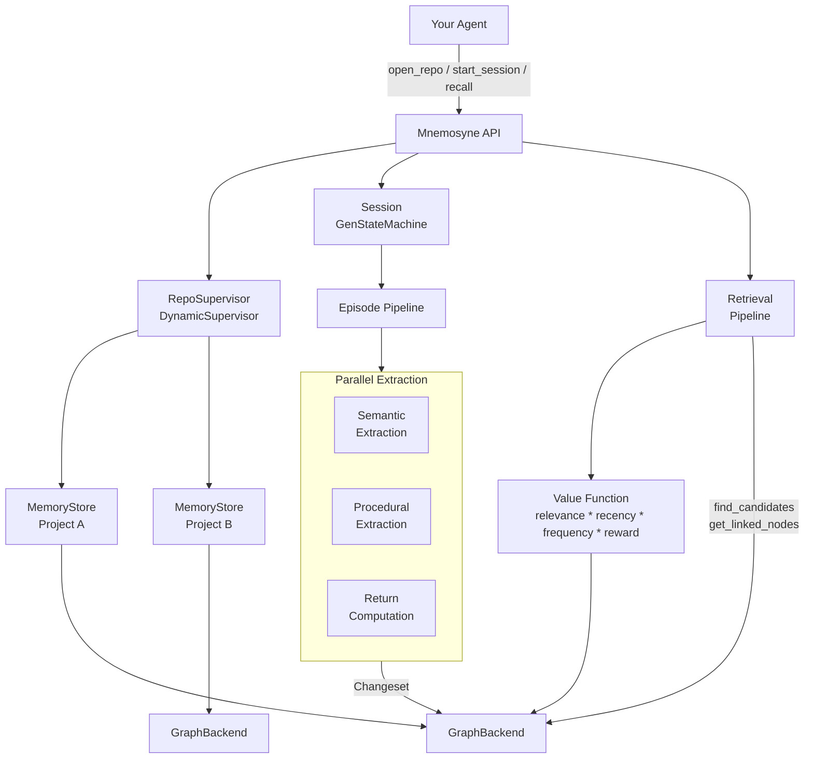
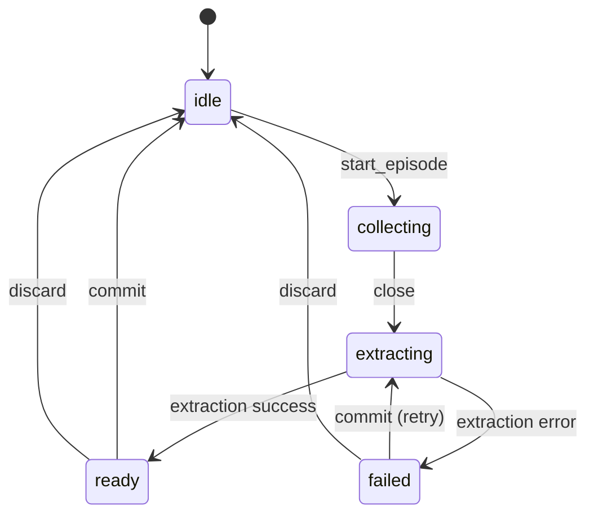

# Mnemosyne

An Elixir implementation of task-agnostic agentic memory for LLM agents, based on the [PlugMem](https://arxiv.org/abs/2603.03296) architecture.

Mnemosyne structures raw agent interactions into a knowledge-centric memory graph, transforming verbose episodic traces into compact, reusable knowledge that any LLM agent can query at decision time.

## Installation

Add `mnemosyne` to your list of dependencies in `mix.exs`:

```elixir
def deps do
  [
    {:mnemosyne, "~> 0.1.4"} # x-release-please-version
  ]
end
```

## Memory Layers

- **Episodic memory** -- detailed records of experience (observation-action pairs)
- **Semantic memory** -- propositional knowledge ("knowing that"), factual statements distilled from episodes
- **Procedural memory** -- prescriptive knowledge ("knowing how"), goal-directed action strategies

## How It Works

Mnemosyne models memory as a three-stage pipeline:

### 1. Structuring -- Episodes to Knowledge

The agent interacts with the world through **sessions**. Each session collects observation-action pairs into **episodes**, and uses LLM inference to annotate each step with subgoals, rewards, and state summaries.

When an episode closes, the **structuring pipeline** extracts knowledge in parallel:

- **Semantic extraction** -- distills factual propositions with confidence scores
- **Procedural extraction** -- abstracts reusable instructions with conditions and expected outcomes
- **Return computation** -- evaluates trajectory quality via cumulative reward signals
- **Sibling linking** -- creates pairwise links between semantic nodes from the same trajectory, preserving co-occurrence structure

Trajectory boundaries are detected automatically using embedding similarity (cosine threshold), splitting episodes into coherent subsequences that share a common intent.

### 2. The Knowledge Graph

All extracted knowledge lives in a graph managed by a pluggable **GraphBackend**, with seven node types:

| Node Type | Purpose |
|-----------|---------|
| **Episodic** | Raw observation-action-reward tuples from interactions |
| **Semantic** | Factual propositions with confidence scores |
| **Procedural** | Instructions with conditions and expected outcomes |
| **Subgoal** | Decomposed objectives linking related knowledge |
| **Source** | Provenance links back to original episode steps |
| **Intent** | Goal abstractions linking related procedural nodes |
| **Tag** | Concept indices linking related semantic nodes |

Nodes are linked bidirectionally and indexed by type, tag, and subgoal for efficient traversal. Mutations are batched through **changesets** that are applied atomically.

### 3. Retrieval -- Knowledge at Decision Time

When the agent needs memory, the retrieval pipeline:

1. Computes an embedding for the query
2. Scores candidate nodes using a **value function** that combines cosine relevance with node metadata (recency, access frequency, reward quality) via a multiplicative formula
3. Returns the highest-scoring knowledge, ranked by decision relevance

### 4. Maintenance -- Graph Hygiene

Two standalone operations keep the graph clean over time:

- **Semantic consolidation** -- discovers near-duplicate semantic nodes that share tag-neighbors, compares their embeddings, and deletes the lower-scored duplicate when similarity exceeds a threshold
- **Node decay** -- scores all nodes on recency, access frequency, and reward quality (without a query), pruning those below a threshold and cleaning up orphaned Tags/Intents

Both are triggered explicitly via `Mnemosyne.consolidate_semantics/2` and `Mnemosyne.decay_nodes/2`.

### 5. Notifier -- Real-Time Events

The `Mnemosyne.Notifier` behaviour receives events whenever the graph changes -- changeset applications, node deletions, decay/consolidation results, recall queries, and session state transitions. Plug in a `Phoenix.PubSub` adapter to build live graph visualizations without any Phoenix dependency in Mnemosyne itself.

Four query functions (`get_node`, `get_nodes_by_type`, `get_metadata`, `get_linked_nodes`) complement the event stream, letting consumers fetch current node state on demand.

See the [Notifier guide](guides/notifier.md) for implementation details and a LiveView example.

## Architecture



### Multi-Repository Isolation

Mnemosyne supports multiple isolated graph repositories under a single supervision tree. Each repository has its own MemoryStore process and GraphBackend instance, identified by an opaque string ID. Shared configuration (LLM, embedding adapters) is set once at supervisor startup; per-repo backend config is provided when opening a repo.

The **Session** is a `GenStateMachine` that manages the episode lifecycle:



## Usage

```elixir
# Open an isolated graph repository for a project
{:ok, _pid} = Mnemosyne.open_repo("my-project",
  backend: {Mnemosyne.GraphBackends.InMemory,
    persistence: {Mnemosyne.GraphBackends.Persistence.DETS, path: "my-project.dets"}})

# Start a session with a goal, tied to a repo
{:ok, session} = Mnemosyne.start_session("Help user plan a trip", repo: "my-project")

# Collect observations and actions during interaction
:ok = Mnemosyne.append(session, "User says they want to visit Tokyo", "Asking about dates")
:ok = Mnemosyne.append(session, "User says next March for 2 weeks", "Suggesting itinerary")

# Close the episode and commit knowledge to the graph
:ok = Mnemosyne.close_and_commit(session)

# Later, recall relevant knowledge for a new decision
{:ok, memories} = Mnemosyne.recall("my-project", "What are the user's travel preferences?")

# List all open repos, close when done
["my-project"] = Mnemosyne.list_repos()
:ok = Mnemosyne.close_repo("my-project")
```

## Configuration

Mnemosyne uses pluggable adapters for LLM, embedding, and graph storage backends. Shared config is provided when starting the supervisor; backend config is per-repo.

```elixir
# Add Mnemosyne to your supervision tree
children = [
  {Mnemosyne.Supervisor,
    config: %Mnemosyne.Config{
      llm: %{model: "gpt-4o-mini", opts: %{}},
      embedding: %{model: "text-embedding-3-small", opts: %{}}
    },
    llm: MyApp.LLMAdapter,
    embedding: MyApp.EmbeddingAdapter}
]
```

### Graph Backends

The `GraphBackend` behaviour abstracts both persistence and querying behind a single interface. The built-in `InMemory` backend stores nodes in an Erlang map with optional DETS persistence:

```elixir
# In-memory only (no persistence, useful for tests)
backend: {Mnemosyne.GraphBackends.InMemory, []}

# With DETS persistence
backend: {Mnemosyne.GraphBackends.InMemory,
  persistence: {Mnemosyne.GraphBackends.Persistence.DETS, path: "memory.dets"}}
```

Custom backends can push queries to external databases (e.g. Postgres with pgvector) by implementing the `Mnemosyne.GraphBackend` behaviour

### LLM and Embedding Adapters

The built-in adapters wrap [Sycophant](https://github.com/edlontech/sycophant) for LLM calls and support [Bumblebee](https://github.com/elixir-nx/bumblebee) for local embeddings.

Per-pipeline-step model overrides are supported via `config.overrides[step_atom]`, so you can use a cheaper model for subgoal inference and a stronger one for knowledge extraction.

## Status

Mnemosyne is under active development. The structuring and session management layers are functional. Retrieval and reasoning modules are partially implemented.

## Acknowledgments

This project is an Elixir implementation inspired by [PlugMem: A Task-Agnostic Plugin Memory Module for LLM Agents](https://arxiv.org/abs/2603.03296) by Ke Yang et al.
