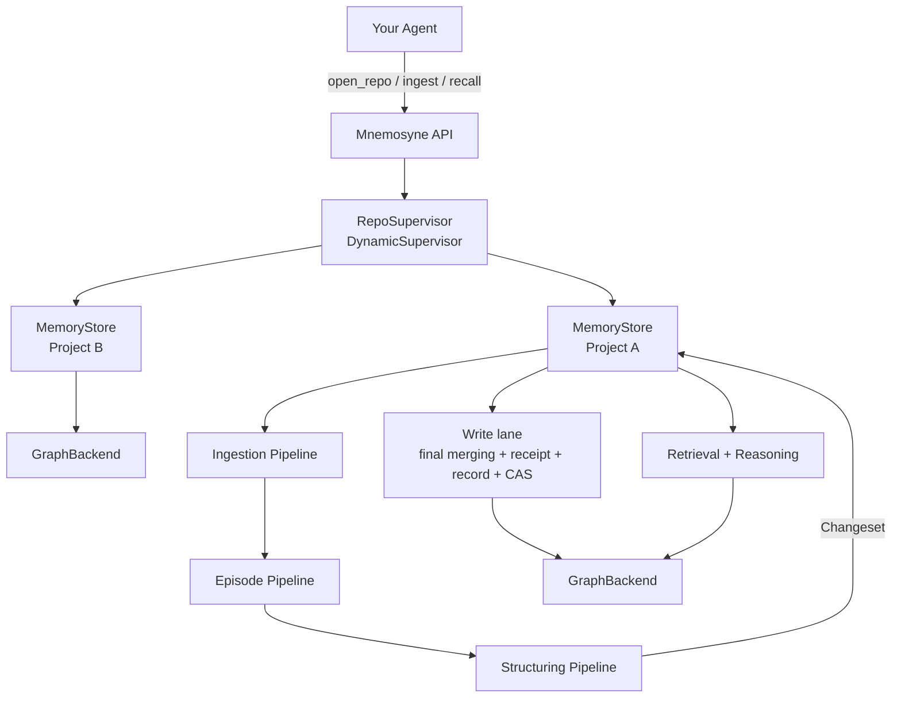

# Mnemosyne

An Elixir implementation of task-agnostic agentic memory for LLM agents, based on the [PlugMem](https://arxiv.org/abs/2603.03296) architecture.

Mnemosyne turns completed agent trajectories into episodic, semantic, and procedural knowledge in a queryable graph. Applications own in-progress work; Mnemosyne accepts complete histories through one blocking ingestion operation.

## Installation

Add `mnemosyne` to your dependencies:

```elixir
def deps do
  [
    {:mnemosyne, "~> 0.3.1"} # x-release-please-version
  ]
end
```

## Quick Start

Start Mnemosyne with LLM and embedding adapters:

```elixir
children = [
  {Mnemosyne.Supervisor,
    config: %Mnemosyne.Config{
      llm: %{model: "gpt-4o-mini", opts: %{}},
      embedding: %{model: "text-embedding-3-small", opts: %{}}
    },
    llm: MyApp.LLMAdapter,
    embedding: MyApp.EmbeddingAdapter}
]
```

Open an isolated graph repository:

```elixir
{:ok, _pid} =
  Mnemosyne.open_repo("my-project",
    backend:
      {Mnemosyne.GraphBackends.InMemory,
       persistence:
         {Mnemosyne.GraphBackends.Persistence.DETS,
          path: "priv/memory/my-project.dets"}}
  )
```

Submit a caller-owned complete trajectory. Steps are processed in list order and `metadata` is part of the payload identity.

```elixir
trajectory = %Mnemosyne.Trajectory{
  source_id: "trip-planning-42",
  goal: "Help the user plan a trip",
  steps: [
    %{
      observation: "The user wants to visit Tokyo",
      action: "Asked about travel dates"
    },
    %{
      observation: "The user plans to travel next March for two weeks",
      action: "Suggested a two-week itinerary"
    }
  ],
  metadata: %{agent: "planner", schema: 1}
}

{:ok, %Mnemosyne.IngestionReceipt{} = receipt} =
  Mnemosyne.ingest("my-project", trajectory)
```

`ingest/3` returns only after storage succeeds and the receipt's nodes are query-visible. A retry with the same repo, `source_id`, and payload returns the exact original receipt, including `node_ids` and `stored_at`. Reusing that source ID for a different goal, ordered steps, metadata, or fingerprint version returns a source-conflict error.

Recall stored knowledge later:

```elixir
{:ok, memories} =
  Mnemosyne.recall("my-project", "What are the user's travel preferences?")
```

For an active task, pass caller-owned context explicitly. Context affects the query but is not stored; `source_id` is optional correlation metadata.

```elixir
{:ok, memories} =
  Mnemosyne.recall("my-project", "What should I ask next?",
    source_id: "trip-planning-43",
    context: %{
      goal: "Plan the user's next trip",
      recent_steps: [
        %{
          observation: "The user is considering Kyoto",
          action: "Compared seasonal weather"
        }
      ]
    }
  )
```

## Memory Model

- **Episodic memory** records observation-action-reward experience.
- **Semantic memory** stores factual propositions distilled from experience.
- **Procedural memory** stores reusable instructions with conditions and outcomes.
- **Tags** and **Intents** route retrieval through related knowledge.
- **Source** nodes preserve provenance to the caller's stable source ID.

During ingestion, Mnemosyne creates an internal episode, annotates each ordered step, detects coherent extraction boundaries, and produces one graph changeset. The repository's `MemoryStore` serializes the final write while extraction for different source IDs can run concurrently.

## Ingestion Guarantees

Source IDs are stable and repo-scoped: the same string can identify independent payloads in different repositories. Equal concurrent calls for a pending source coalesce into one extraction and receive the same receipt. The first admitted call supplies the execution configuration for that shared work.

Per-call `config`, `llm`, `embedding`, and `llm_opts` change ingestion execution only. The config supplies options for ordinary trajectory embedding calls; `embedding_opts` currently applies only to write-time intent merging. None of these options enter payload identity or rebuild an already stored source. Applications own unfinished steps, recovery after an error, and concurrency policy before submitting complete trajectories.

## Architecture


```mermaid
graph TD
    Agent[Your Agent] -->|open_repo / ingest / recall| API[Mnemosyne API]
    API --> RepoSup[RepoSupervisor\nDynamicSupervisor]
    RepoSup --> Store1[MemoryStore\nProject A]
    RepoSup --> Store2[MemoryStore\nProject B]
    Store2 --> Backend2[GraphBackend]
    Store1 --> Ingestion[Ingestion Pipeline]
    Ingestion --> Episode[Episode Pipeline]
    Episode --> Structuring[Structuring Pipeline]
    Structuring -->|Changeset| Store1
    Store1 --> WriteLane[Write lane\nfinal merging + receipt + record + CAS]
    WriteLane --> Backend1[GraphBackend]
    Store1 --> Retrieval[Retrieval + Reasoning]
    Retrieval --> Backend1
```

Each repository has its own `MemoryStore` and backend. The built-in `InMemory` backend can persist to DETS; custom backends implement `Mnemosyne.GraphBackend`.

## Maintenance and Events

`Mnemosyne.consolidate_semantics/2` merges near-duplicate semantic knowledge, and `Mnemosyne.decay_nodes/2` removes low-utility graph nodes. Ingestion identity records remain after graph deletion or decay, so retrying a deleted source returns its original receipt rather than recreating memory.

`Mnemosyne.Notifier` emits authoritative ingestion, recall, graph-write, and maintenance outcomes. Notifier failures are isolated from memory operations.

## Guides

- [Getting Started](guides/getting-started.md)
- [Core Concepts](guides/core-concepts.md)
- [Trajectory Ingestion](guides/trajectory-ingestion.md)
- [Extraction Profiles](guides/extraction-profiles.md)
- [Retrieval and Recall](guides/retrieval-and-recall.md)
- [Custom Backends](guides/custom-backends.md)
- [Custom Adapters](guides/custom-adapters.md)
- [Multi-Repository Isolation](guides/multi-repo.md)
- [Graph Maintenance](guides/graph-maintenance.md)
- [Notifier](guides/notifier.md)

## Acknowledgments

Inspired by [PlugMem: A Task-Agnostic Plugin Memory Module for LLM Agents](https://arxiv.org/abs/2603.03296) by Ke Yang et al.
